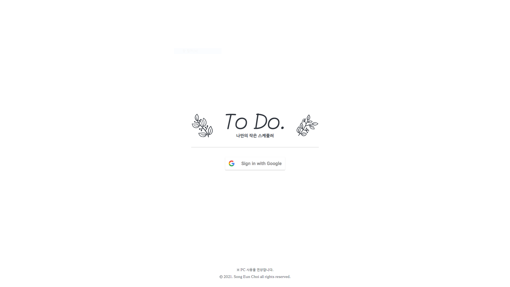
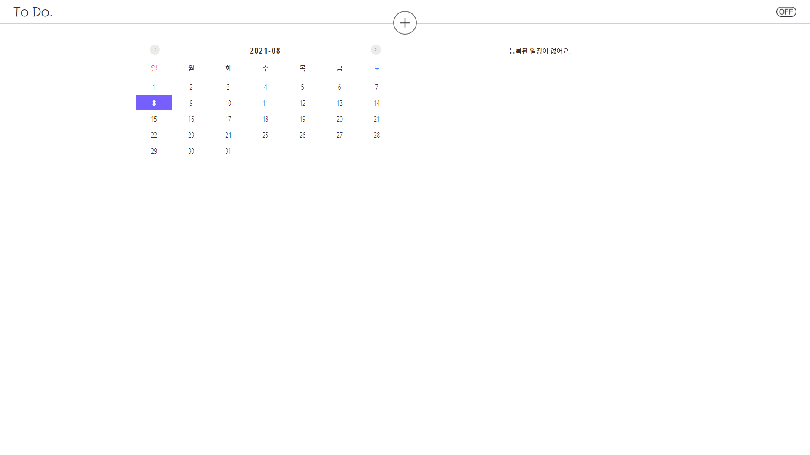
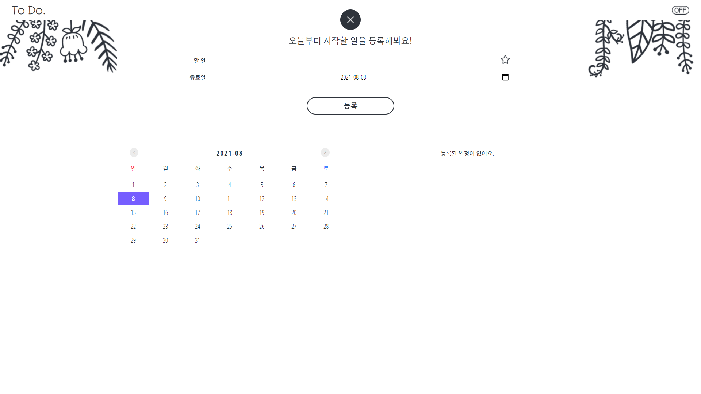
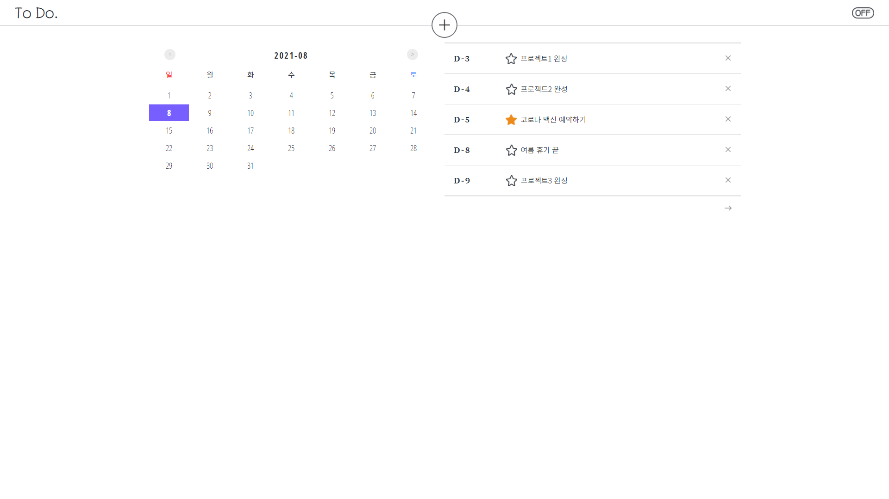
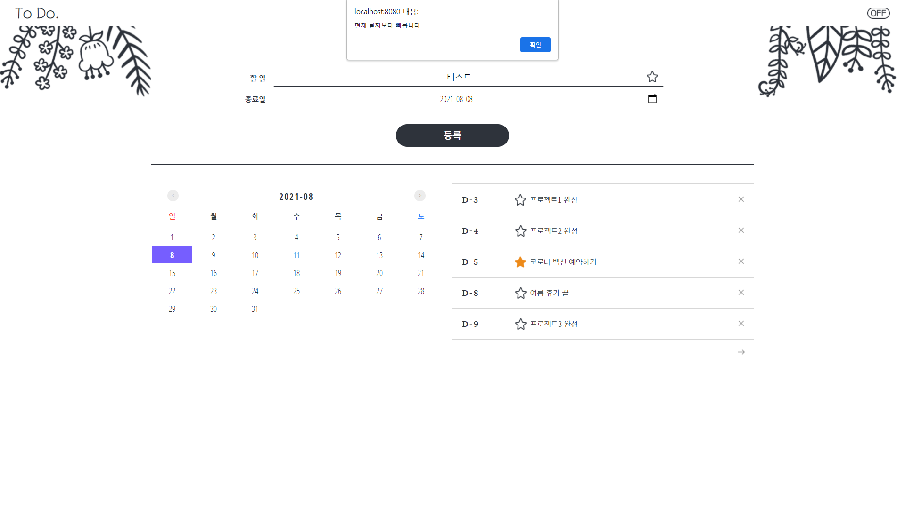
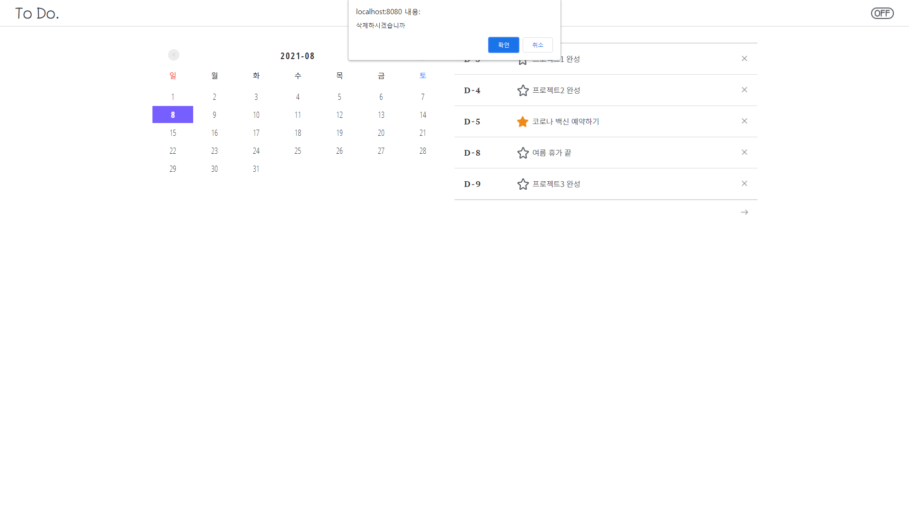
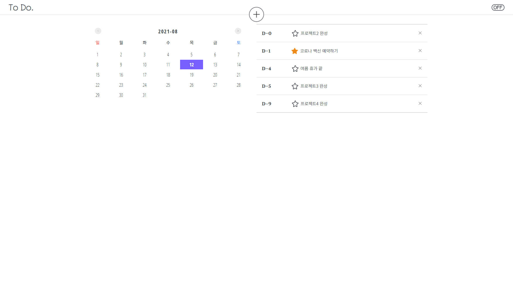
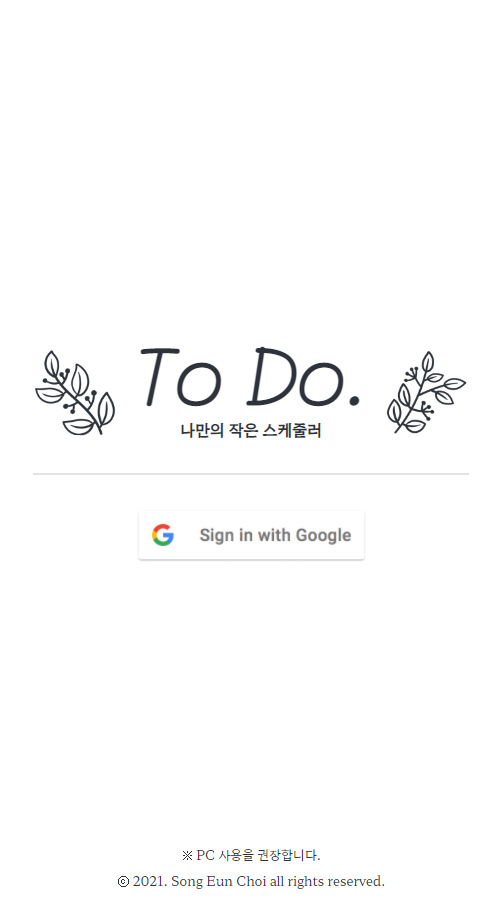
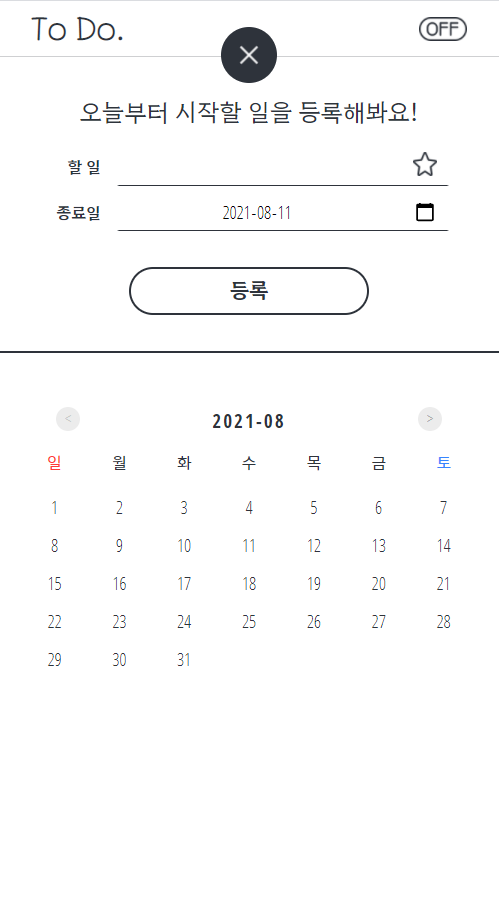

# TODO LIST (With Spring boot)

## how to Build?
```bash
./mvnw package
```

## Skills

front: , ,  

Database:, 

Server Framework:  + 


## Collaborators

design: [최송은](https://github.com/ostrichtofu)

programming: [김기현](https://github.com/kiheyunkim)

## Feature

1. 구글 로그인을 통한 사용자 구분
2. 중요/비중요로 구분하여 별 표시를 하도록 변경
3. 해당 날짜를 클릭한 경우 등록되어있는 자신의 목록중 끝나는 날짜가 클릭된 날짜보다 이전인 경우 해당하는 모든 스케쥴 목록을 보여줌. 
4. 반응형으로 제작되어 PC/Mobile 화면 대응 가능

## ScreenShots


















## DB Schema

MariaDB
```sql
CREATE TABLE IF NOT EXISTS USER_TABLE
(
    IDENTITY_ID INT NOT NULL PRIMARY KEY AUTO_INCREMENT,
    EMAIL       VARCHAR(255) NOT NULL,
    NAME        VARCHAR(255) NOT NULL
);
```

MongoDB
```kotlin
data class TodoElement(
	val email: String,
	val task: String,
	val endDate: LocalDate,
	val registerDate: LocalDate
)
```

### Application.yml

```yaml
spring:
  datasource:
    driver-class-name: org.mariadb.jdbc.Driver
    url: "jdbc:mysql://localhost:3306/TODO_LIST?serverTimezone=UTC&characterEncoding=UTF-8"
    username: "MARIADB_USER"
    password: "MARIADB_PASSWORD"
  sql:
    init:
      mode: always
  security:
    oauth2:
      client:
        registration:
          google:
            client-id: "GOOGLE_AUTH_CLIENT_ID"
            client-secret: "GOOGLE_AUTH_CLIENT_SECRET"
            scope: profile,email
  data:
    mongodb:
      database: "todoList"
      host: "127.0.0.1"
      port: 27017

mybatis:
  mapper-locations: "classpath:mybatis-mapper/*.xml"
logging:
  level:
    root: debug
```


## known issue


## License